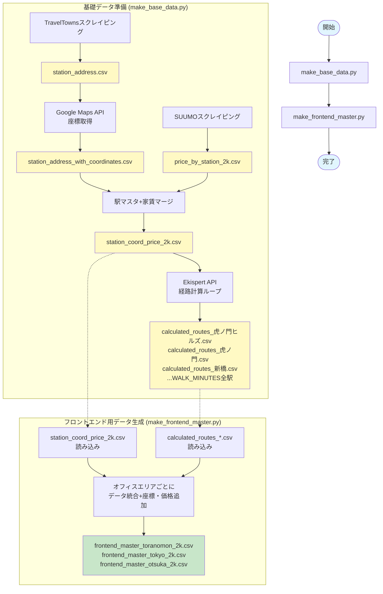
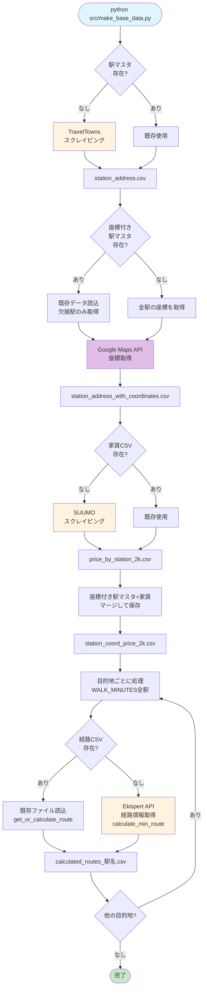

# StationScraper 基礎データパイプライン

> **作成日**: 2025年10月19日
> **最終更新**: 2025年10月20日
> **目的**: 関東エリアの駅データ、家賃相場、経路情報を収集・統合する基礎データパイプラインのドキュメント

## 概要

このプロジェクトは、関東エリアの鉄道駅情報を収集し、家賃相場と通勤経路データを統合する**2段階の基礎データパイプライン**です。

**処理フロー**:
1. **make_base_data.py**: 駅マスタ、座標、家賃、経路計算の基礎データを生成
2. **make_frontend_master.py**: オフィスエリアごと（虎ノ門/東京/大塚）のフロントエンド用マスターデータを生成

**データソース**:
- TravelTowns（駅リスト）
- SUUMO（家賃相場）
- Google Maps API（座標）
- Ekispert API（経路情報）

---

## データフロー



**凡例**:
- 黄色: 中間データファイル
- 緑色: 最終出力ファイル（フロントエンド用マスター）
- 青色: 開始/完了

---

## データパイプライン詳細

### **src/** - 基礎データパイプライン

#### 役割
外部ソースから生データを収集し、CSVファイルとして保存する**データパイプラインの起点**。

#### 処理フロー



**現在の実装の特徴**:
- ステップ4でマージ結果を `station_coord_price_{ROOM_TYPE}.csv` に保存
- ステップ5で `get_or_calculate_route()` ヘルパー関数を使用し既存ファイルをキャッシュとして活用
- 出力先は `data/calculated_routes/` ディレクトリ
- **make_base_data.py は基礎データ準備のみ**。フロントエンド用データは別スクリプト（make_frontend_master.py）で生成

**2段階の処理フロー**:
1. **make_base_data.py**: 駅マスタ、座標、家賃、経路計算の基礎データを生成
2. **make_frontend_master.py**: オフィスエリアごと（虎ノ門/東京/大塚）のフロントエンド用マスターデータを生成

#### 主要ファイル

| ファイル | 役割 | 状態 |
|---------|------|------|
| `src/make_base_data.py` | 基礎データ準備パイプライン（関数化済み）<br/>- 5ステップ処理: 駅マスタ取得→座標付与→家賃取得→マージ→経路計算<br/>- `WALK_MINUTES` の各目的地への経路計算ループ | ✅ 動作 |
| `src/make_frontend_master.py` | フロントエンド用マスターデータ生成<br/>- オフィスエリアごと（虎ノ門/東京/大塚）にデータ統合<br/>- 座標・価格・徒歩時間を追加<br/>- `frontend_master_{office}_{ROOM_TYPE}.csv` を生成 | ✅ 動作 |
| `src/temp.py` | バックアップファイル（非推奨）<br/>- make_frontend_master.py への移行元<br/>- 動作確認後に削除予定 | ⚠️ 非推奨 |
| `src/functions.py` | パイプライン関数群<br/>- `make_station_master()`: 駅マスタ取得<br/>- `add_geocode_to_station_master()`: 座標付与（既存データ活用）<br/>- `make_rent_data()`: 家賃データ取得<br/>- `make_merged_data()`: マージ処理（CSV保存あり）<br/>- `calculate_min_route()`: Ekispert API で経路計算<br/>- `get_or_calculate_route()`: キャッシュ機能付き経路取得ヘルパー | ✅ 動作 |
| `src/config.py` | 設定ファイル<br/>- `EKISPERT_KEY`, `GOOGLE_MAPS_KEY`: API キー<br/>- `ROOM_TYPE`: 部屋タイプ (2k)<br/>- `WALK_MINUTES`: 目的地駅と徒歩時間のマッピング<br/>- `TO_TORANOMON_LIST`, `TO_TOKYO_LIST`, `TO_OTSUKA_LIST`: オフィスエリアごとの対象駅リスト | ✅ 動作 |
| `src/scrapers/traveltowns_scraper.py` | TravelTownsスクレイピング | ✅ 動作 |
| `src/scrapers/suumo_scraper.py` | SUUMOスクレイピング | ✅ 動作 |
| `src/apis/ekispert.py` | Ekispert API呼び出し<br/>- 駅名正規化フォールバック機能追加済み | ✅ 動作 |
| `src/apis/google_maps.py` | Google Maps API呼び出し | ✅ 動作 |
| `src/pipeline/data_cleaning.py` | データクリーニング・路線名正規化 | ✅ 動作 |
| `src/pipeline/analysis.py` | フィルタリング処理 | ✅ 動作 |
| `src/pipeline/visualization.py` | 散布図描画 | ✅ 動作 |

#### 生成されるデータ

```
data/
├── station_master/
│   ├── station_address.csv                      # 駅マスタ（2,496駅）
│   └── station_address_with_coordinates.csv     # 座標付き駅マスタ（2,496駅、全駅に座標あり）
├── price_by_station/
│   ├── price_by_station_one_room.csv            # ワンルーム家賃データ（2,167駅）
│   ├── price_by_station_1k.csv                  # 1K家賃データ
│   └── price_by_station_2k.csv                  # 2K家賃データ
├── station_coord_price/
│   ├── station_coord_price_one_room.csv         # 駅+座標+家賃マージデータ（ワンルーム）
│   ├── station_coord_price_1k.csv               # 駅+座標+家賃マージデータ（1K）
│   └── station_coord_price_2k.csv               # 駅+座標+家賃マージデータ（2K）
├── calculated_routes/
│   ├── calculated_routes_虎ノ門ヒルズ.csv
│   ├── calculated_routes_虎ノ門.csv
│   ├── calculated_routes_新橋.csv
│   ├── calculated_routes_霞ケ関.csv
│   ├── calculated_routes_国会議事堂前.csv
│   ├── calculated_routes_溜池山王.csv
│   ├── calculated_routes_桜田門.csv
│   ├── calculated_routes_内幸町.csv
│   └── ...（WALK_MINUTESの全目的地）          # 各目的地への経路情報
└── frontend_master/
    ├── frontend_master_toranomon_2k.csv        # 虎ノ門エリア向けマスターデータ
    ├── frontend_master_tokyo_2k.csv            # 東京エリア向けマスターデータ
    └── frontend_master_otsuka_2k.csv           # 大塚エリア向けマスターデータ
```

**注**: `data/output/route_info/` と `data/output/merged/` はレガシーディレクトリ（現在は生成されていない）

#### CSVファイル構造詳細

##### 1. station_address.csv
関東の全鉄道路線の駅名リスト（2,496駅）

| カラム名 | データ型 | 説明 |
|---------|---------|------|
| `line` | TEXT | 路線名（例: JR山手線） |
| `station` | TEXT | 駅名（例: 東京） |

**生成**: `src/scrapers/traveltowns_scraper.py:scrape_traveltowns_kanto()`

##### 2. station_address_with_coordinates.csv
駅マスタに緯度経度を追加したデータ（2,070駅に座標あり）

| カラム名 | データ型 | 説明 |
|---------|---------|------|
| `line` | TEXT | 路線名 |
| `station` | TEXT | 駅名 |
| `lat` | FLOAT | 緯度 |
| `lng` | FLOAT | 経度 |

**保存先**: `data/station_master/station_address_with_coordinates.csv`

**生成**: `src/make_base_data.py:add_geocode_to_station_master()` (Google Maps API経由、既存データ活用)

**特徴**:
- 既存の座標データがある場合は読み込んで活用（API使用量を節約）
- 座標がない駅のみ新規取得
- 複数のクエリパターン（路線名+駅名、駅名のみなど）で取得を試行

##### 3. price_by_station_one_room.csv
SUUMOからスクレイピングした駅ごとのワンルーム家賃相場（2,167駅）

| カラム名 | データ型 | 説明 |
|---------|---------|------|
| `line` | TEXT | 路線名（例: ＊＊山手線） |
| `station` | TEXT | 駅名 |
| `price` | FLOAT | 家賃相場（万円） |

**生成**: `src/scrapers/suumo_scraper.py:scrape_suumo_rent()`

**注意**: 路線名の表記が駅マスタと異なる（全角JR vs 半角JR等）

##### 4. station_coord_price_{room_type}.csv
駅マスタ、座標、家賃相場を統合したマージデータ

| カラム名 | データ型 | 説明 |
|---------|---------|------|
| `line` | TEXT | 路線名（正規化済み） |
| `station` | TEXT | 駅名 |
| `lat` | FLOAT | 緯度 |
| `lng` | FLOAT | 経度 |
| `price` | FLOAT | 家賃相場（万円）、欠損値あり |

**保存先**: `data/station_coord_price/station_coord_price_{ROOM_TYPE}.csv`

**生成**: `src/make_base_data.py` ステップ4（`make_merged_data()` → CSV保存）

**特徴**:
- 路線名正規化によりマージ率向上（44.4% → 78.1%）
- 座標がない駅、家賃データがない駅も含む（欠損値として保持）
- 経路計算の入力データとして使用

##### 5. calculated_routes_{駅名}.csv
各駅から特定の目的地駅への最適経路情報

| カラム名 | データ型 | 説明 |
|---------|---------|------|
| `line` | TEXT | 路線名 |
| `price` | FLOAT | 家賃相場（万円） |
| `from` | TEXT | 出発駅 |
| `to` | TEXT | 目的駅（虎ノ門ヒルズ、内幸町など） |
| `trans` | INT | 乗換回数 |
| `min` | INT | 所要時間（分）電車のみ |

**保存先**: `data/calculated_routes/calculated_routes_{目的地駅名}.csv`

**生成**: `src/make_base_data.py` ステップ5（`get_or_calculate_route()` → CSV保存）

**目的地**: `WALK_MINUTES` に定義された全駅（虎ノ門ヒルズ、内幸町、大塚など）

**特徴**:
- 既存ファイルがあれば読み込み（API呼び出しをスキップ）
- priceがNaNの駅はスキップされる
- 徒歩時間は**含まれていない**（将来実装予定）

##### 6. frontend_master_{office}_{room_type}.csv
オフィスエリアごとの最適化されたフロントエンド用マスターデータ

| カラム名 | データ型 | 説明 |
|---------|---------|------|
| `line` | TEXT | 路線名 |
| `from` | TEXT | 出発駅 |
| `to` | TEXT | 目的駅 |
| `trans` | INT | 乗換回数 |
| `min` | INT | 所要時間（分）電車のみ |
| `lat` | FLOAT | 出発駅の緯度 |
| `lng` | FLOAT | 出発駅の経度 |
| `price` | FLOAT | 家賃相場（万円） |
| `walk_min` | INT | 目的駅からの徒歩時間（分） |

**保存先**: `data/frontend_master/frontend_master_{office}_{ROOM_TYPE}.csv`

**生成**: `src/make_frontend_master.py`

**オフィスエリア**:
- `toranomon`: 虎ノ門エリア（虎ノ門ヒルズ、虎ノ門、新橋など8駅）
- `tokyo`: 東京エリア（東京、日本橋、大手町など7駅）
- `otsuka`: 大塚エリア（大塚駅のみ）

**特徴**:
- オフィスエリアごとに対象駅を絞り込んだデータ
- 地図可視化アプリで使用するための最終データセット
- 座標・価格・徒歩時間が統合済み
- Webアプリ（mapapp/）の入力データとして使用

**データ例**:
```csv
line,from,to,trans,min,lat,lng,price,walk_min
JR中央・総武線各駅停車,三鷹,虎ノ門ヒルズ,1,58,35.7027156,139.5610291,11.5,4
JR中央・総武線各駅停車,吉祥寺,虎ノ門ヒルズ,1,55,35.7031485,139.5798087,12.0,4
```

---

### レガシーCSVファイル（現在は生成されていない）

以下のファイルは過去のバージョンで生成されていましたが、現在の実装では生成されていません。

##### route_info_*.csv ⚠️ **レガシー**

**保存先**: `data/output/route_info/route_info_{目的地駅名}.csv`

**現状**: 現在の `src/make_base_data.py` では生成されていません。`calculated_routes/` に置き換えられました。

**過去の用途**: 各駅から目的地への経路情報（徒歩時間加算済み）

##### merged_info_one_room.csv ⚠️ **レガシー**

**保存先**: `data/output/merged/merged_info_one_room.csv`

**現状**: 現在の `src/make_base_data.py` では生成されていません。

**過去の用途**: 全目的地の経路情報を統合したデータ

---

#### 将来の実装予定

以下の機能は現在実装されていませんが、実装予定です：

1. **徒歩時間を考慮した通勤時間DataFrame作成（全目的地統合版）**
   - 全目的地の `calculated_routes_{駅名}.csv` を統合
   - 新カラム `total_commute_time` = `min` + `walk_min`

2. **複数条件での絞り込み処理**
   - 家賃上限、通勤時間上限、乗換回数上限などのフィルタリング
   - フィルタリング済みデータを別ファイルに保存

#### 改善済み
- ✓ 空ファイル（analysis.py、visualization.py）を削除（2025年10月19日）
- ✓ Jupyterノートブック的構造を整理し、メインパイプラインを関数化（2025年10月19日）
- ✓ ジオコーディング処理をパイプラインに統合、既存データ活用により効率化（2025年10月19日）
- ✓ 路線名の表記揺れを完全解決（44.4% → 78.1%）、正規化ロジックを実装（2025年10月19日）
- ✓ 中間CSV廃止、make_merged_data()をメモリ内処理に簡素化（2025年10月19日）
- ✓ main.pyを temp.py ベースに書き換え、calculated_routes/ に出力（2025年10月20日）
- ✓ get_or_calculate_route() ヘルパー関数追加でキャッシュ対応（2025年10月20日）
- ✓ station_coord_price_{ROOM_TYPE}.csv をパイプラインで生成・保存（2025年10月20日）
- ✓ **フロントエンド用マスターCSV作成**（2025年10月20日）
  - `make_frontend_master.py` を作成
  - オフィスエリアごと（虎ノ門/東京/大塚）のマスターデータを生成
  - 座標・価格・徒歩時間を統合したWebアプリ用最終データセット

---

## ディレクトリ構造

```
stationscraper/
├── .env                                    # 環境変数（APIキー）
├── .gitignore
├── CLAUDE.md                               # Claude Code向けプロジェクト説明
├── README.md                               # プロジェクト概要
├── PROJECT_OVERVIEW.md                     # 本ドキュメント
│
├── data/                                   # データストレージ
│   ├── station_master/
│   │   ├── station_address.csv             # 駅マスタ（2,496駅）
│   │   └── station_address_with_coordinates.csv # 座標付き駅マスタ（2,496駅、全駅座標あり）
│   ├── price_by_station/
│   │   ├── price_by_station_one_room.csv   # ワンルーム家賃（2,167駅）
│   │   ├── price_by_station_1k.csv         # 1K家賃データ
│   │   └── price_by_station_2k.csv         # 2K家賃データ
│   ├── station_coord_price/
│   │   ├── station_coord_price_one_room.csv # 駅+座標+家賃マージ（ワンルーム）
│   │   ├── station_coord_price_1k.csv      # 駅+座標+家賃マージ（1K）
│   │   └── station_coord_price_2k.csv      # 駅+座標+家賃マージ（2K）
│   ├── calculated_routes/                   # 各目的地への経路情報
│   │   ├── calculated_routes_虎ノ門ヒルズ.csv
│   │   ├── calculated_routes_虎ノ門.csv
│   │   ├── calculated_routes_新橋.csv
│   │   ├── calculated_routes_内幸町.csv
│   │   ├── calculated_routes_大塚.csv
│   │   └── ...（WALK_MINUTES全駅）
│   └── frontend_master/                     # オフィスエリア別マスターデータ
│       ├── frontend_master_toranomon_2k.csv  # 虎ノ門エリア向け
│       ├── frontend_master_tokyo_2k.csv      # 東京エリア向け
│       └── frontend_master_otsuka_2k.csv     # 大塚エリア向け
│
└── src/                                    # 基礎データパイプライン
    ├── make_base_data.py                   # 基礎データ準備
    ├── make_frontend_master.py             # フロントエンド用データ生成
    ├── temp.py                             # バックアップ（非推奨・削除予定）
    ├── functions.py                        # パイプライン関数群
    ├── config.py                           # 設定ファイル
    ├── scrapers/
    │   ├── traveltowns_scraper.py          # TravelTownsスクレイピング
    │   └── suumo_scraper.py                # SUUMOスクレイピング
    ├── apis/
    │   ├── ekispert.py                     # Ekispert API
    │   └── google_maps.py                  # Google Maps API
    └── pipeline/
        ├── data_cleaning.py                # データクリーニング
        ├── analysis.py                     # フィルタリング
        └── visualization.py                # 散布図描画
```

---

## 実行方法

### 環境セットアップ

```bash
# 環境変数設定（.envファイル作成）
EKISPERT_KEY=your_key_here
GOOGLE_MAPS_KEY=your_key_here

# 依存パッケージインストール
pip install -r requirements.txt
pip install python-dotenv  # requirements.txtに未記載
```

### パイプライン実行

```bash
cd src

# 1. 基礎データ準備（駅マスタ、座標、家賃、経路計算）
python make_base_data.py

# 2. フロントエンド用データ生成（オフィスエリア別）
python make_frontend_master.py
```

**注意**:
- 初回実行時はスクレイピング・API呼び出しで数時間かかる可能性あり
- `make_frontend_master.py` は `make_base_data.py` の実行後に実行すること
- 既存ファイルがある場合はスキップされるため、2回目以降は高速


---

## 関連ドキュメント

- [CLAUDE.md](./CLAUDE.md) - Claude Code向けプロジェクト説明
- [README.md](./README.md) - プロジェクト概要
- [AGENTS.md](./AGENTS.md) - Repository Guidelines（開発原則）

---

## 変更履歴

### 2025年10月19日（リファクタリング第4弾: ディレクトリ・ファイル名統一）
- **ディレクトリ名変更**: `data/station_price/` → `data/price_by_station/` (日本人にも馴染みやすい命名に統一)
- **CSVファイル名変更**: `station_price_*.csv` → `price_by_station_*.csv` (3ファイル)
- **コード修正**: `src/functions.py`, `nxt_gen/config.py` のパス参照を更新

### 2025年10月19日（リファクタリング第3弾: 中間CSV廃止）
- **price_by_station_*.csv の完全廃止**: 負の遺産であった中間CSVファイルを削除
  - 壊れたCSVキャッシュによるバグを根絶
  - `make_merged_data()` 関数を約30行→約15行に簡素化
  - CSV保存・読み込みロジックを完全削除
- **nxt_gen/のデータ読み込みロジック改修**:
  - `nxt_gen/data_loader.py` の `load_price_data()` を書き換え
  - 元データ（`station_address_with_coordinates.csv` + `station_price_one_room.csv`）から直接生成
  - `src/pipeline/data_cleaning.py` の正規化ロジックを再利用
- **設定ファイル更新**:
  - `nxt_gen/config.py`: `PRICE_DATA_PATH` → `PRICE_ORIGINAL_PATH` に変更
- **不要関数の削除**:
  - `src/pipeline/data_cleaning.py` の `merge_station_info()` 関数を削除（未使用）
  - `src/functions.py` から対応するimportを削除
- **効果**:
  - コード行数削減: 約50行
  - ファイルI/O削減: 中間ファイルの読み書きが不要
  - 保守性向上: キャッシュ問題の完全解消
  - データ整合性: 常に最新の正規化ロジックが適用される

### 2025年10月19日（リファクタリング第2弾）
- **座標付き駅マスタの早期生成**: パイプラインで `station_address.csv` 作成後すぐに座標情報を付与する仕組みを実装
- **geocode_station() 関数追加**: 複数のクエリパターン（路線名+駅名、駅名のみなど）で座標取得を試行し成功率を向上
- **add_geocode_to_station_master() 関数追加**: 既存座標データを活用し、欠損駅のみ新規取得する効率的な実装
  - API使用量を節約（既存データがある場合は欠損駅のみ取得）
  - 進捗表示とレート制限対応を実装
- **ジオコーディング処理の統合**: コメントアウトされていた座標取得処理をパイプラインに正式統合
- **不要コードの削除**: 末尾のデバッグ用コードとコメントアウトされたコードを削除
- **geocode_missing_stations.py と missing_coords_geocoded.csv を削除**: 機能がmain.pyに統合されたため冗長なファイルを削除

### 2025年10月19日（リファクタリング第1弾）
- **nominatim削除**: 未使用のnominatimディレクトリとドキュメント記載を削除（Google Maps API使用のため不要）
- **line_url.csv削除**: 過去の実装で使われていた中間ファイルを削除（現在は`scrape_traveltowns_kanto()`関数に統合済み）
- **src/make_base_data.pyリファクタリング**: メインパイプラインを5つのヘルパー関数（`make_*()`）に分割し可読性を向上

### 2025年10月20日（main.py 実装更新）
- **main.py を temp.py ベースに書き換え**:
  - 処理フローを明確化: 駅マスタ取得→座標付与→家賃取得→マージ→経路計算の5ステップ
  - `make_route_data()` 削除 → `calculate_min_route()` + ループ処理に変更
  - 出力先を `data/calculated_routes/calculated_routes_{駅名}.csv` に変更（レガシーの `route_info/` から移行）
  - `station_coord_price_{ROOM_TYPE}.csv` の保存処理を追加（ステップ4）
- **get_or_calculate_route() ヘルパー関数追加**（`src/functions.py`）:
  - 既存ファイルがあれば読み込み、なければ計算する仕組み
  - API 呼び出しを削減しパフォーマンス向上
  - ログ出力で処理状況を可視化（"既存ファイルを読み込みました" / "経路情報を計算中..."）
- **将来の実装予定を明記**:
  - 徒歩時間を考慮した通勤時間DataFrame作成（予定）
  - 複数条件での絞り込み処理（予定）
  - フロントエンド用マスターCSV作成（予定）
- **ドキュメント更新**: PROJECT_OVERVIEW.md を現在の実装状況に正確に反映

### 2025年10月20日（パイプライン責任分離とリネーミング）
- **make_frontend_master.py 作成**:
  - オフィスエリアごとのフロントエンド用マスターデータ生成機能を分離
  - 虎ノ門、東京、大塚の3つのオフィスエリア向けにデータを統合
  - 座標・価格・徒歩時間を追加した最終データセットを生成
  - `data/frontend_master/frontend_master_{office}_{ROOM_TYPE}.csv` を出力
- **main.py → make_base_data.py リネーム**:
  - 汎用的な基礎データ準備スクリプトであることを明確化
  - make_frontend_master.py と命名規則を統一（make_xxx）
  - 処理フローを2段階に分離（基礎データ準備 → フロントエンドデータ生成）
- **temp.py の位置付け変更**:
  - make_frontend_master.py への移行元として残置
  - ファイル冒頭に非推奨・削除予定を明記
- **ドキュメント更新**:
  - CLAUDE.md、AGENTS.md、PROJECT_OVERVIEW.md、README.md を更新
  - make_frontend_master.py の説明とデータ構造を追加
  - 実行方法を2段階フローに変更

### 2025年10月20日（ドキュメントスコープの明確化）
- **PROJECT_OVERVIEW.md のスコープ変更**:
  - 基礎データパイプライン（src/）のみに焦点を当てたドキュメントに再構成
  - nxt_gen/ と mapapp/ に関する記載を全て削除（今後大幅変更予定のため）
  - タイトルを「プロジェクト全体像」→「基礎データパイプライン」に変更
  - 冒頭の問題点セクション削除（3つの実装混在という前提が不要に）
  - データフロー図とディレクトリ構造を src/ と data/ のみに簡素化
  - 問題点・改善提案・まとめセクションを削除（src/のみに焦点を当てるため不要）
- **データフロー図の改善**:
  - データフローセクションをドキュメント冒頭（概要の直後）に移動
  - フローの方向を左→右から上→下に変更（flowchart TD）
  - 具体的なスクリプト名（make_base_data.py、make_frontend_master.py）を明記
  - 具体的な出力ファイル名（*.csv）を全て明記
  - 処理ステップとデータファイルを色分けして視認性を向上

---

**作成者**: Claude Code
**最終更新**: 2025年10月20日
