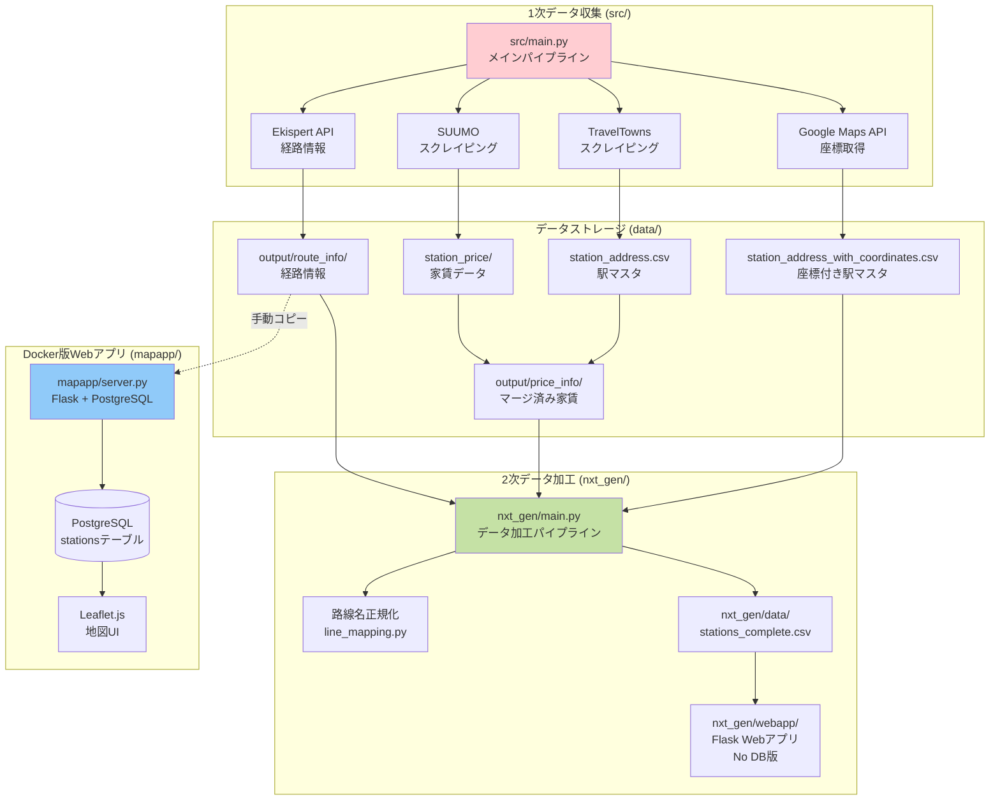
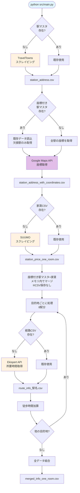
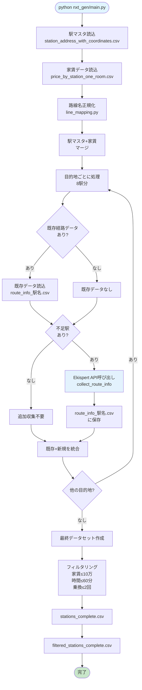
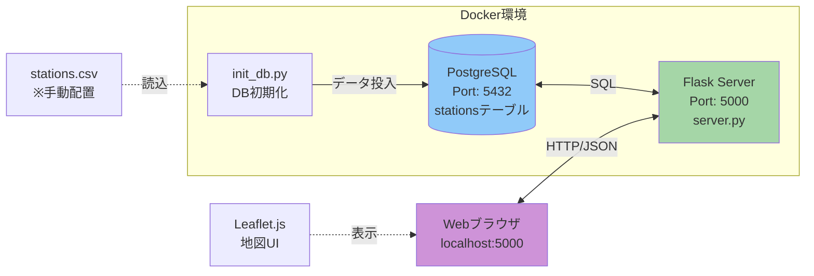
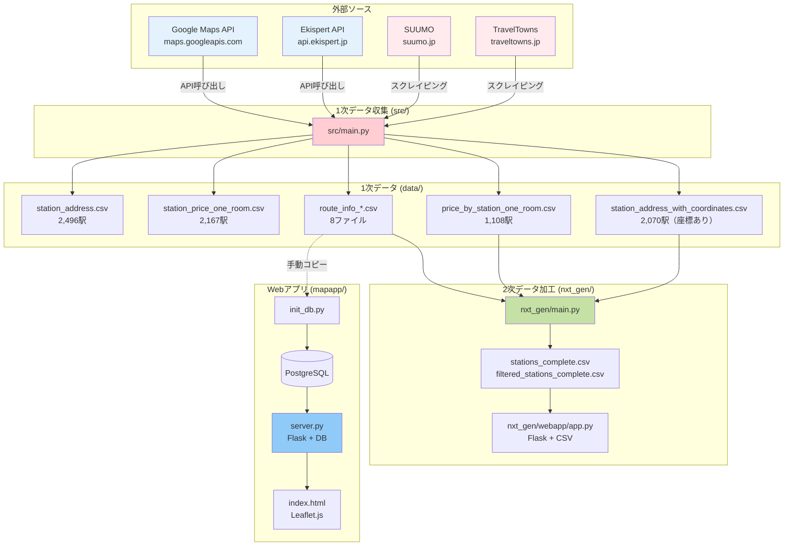

# StationScraper プロジェクト全体像

> **作成日**: 2025年10月19日
> **目的**: プロジェクトの現状を正確に把握し、複雑化した構造を整理するための包括的ドキュメント

## ⚠️ 現状の問題点

このプロジェクトは**同じ目的（駅情報の可視化）に対して3つの異なる実装**が混在しており、以下の問題があります：

- **冗長性**: 類似機能の重複実装
- **データ依存の複雑さ**: 各システムが異なるデータソースに依存
- **未完成部分**: 空ファイルや未実装機能が散在
- **ドキュメント不足**: 実装間の関係性が不明確

---

## プロジェクト構成の全体像



---

## システム別詳細説明

### 1. **src/** - オリジナル実装（1次データ収集）

#### 役割
外部ソースから生データを収集し、CSVファイルとして保存する**データパイプラインの起点**。

#### 処理フロー



#### 主要ファイル

| ファイル | 役割 | 状態 |
|---------|------|------|
| `src/main.py` | メインパイプライン（関数化済み）<br/>- `geocode_station_with_retry()`: 複数パターンで座標取得<br/>- `add_geocode_to_station_master()`: 駅マスタに座標付与<br/>- `make_*()`: パイプライン各ステップの関数群 | ✅ 動作 |
| `src/functions.py` | パイプライン関数群<br/>- `make_merged_data()`: メモリ内でデータマージ（CSV保存なし） | ✅ 動作 |
| `src/config.py` | 設定ファイル（API KEY、目的地など） | ⚠️ 一部定数未定義 |
| `src/scrapers/traveltowns_scraper.py` | TravelTownsスクレイピング | ✅ 動作 |
| `src/scrapers/suumo_scraper.py` | SUUMOスクレイピング | ✅ 動作 |
| `src/apis/ekispert.py` | Ekispert API呼び出し | ✅ 動作 |
| `src/apis/google_maps.py` | Google Maps API呼び出し | ✅ 動作 |
| `src/pipeline/data_cleaning.py` | データクリーニング・路線名正規化 | ✅ 動作 |
| `src/pipeline/analysis.py` | フィルタリング処理 | ⚠️ config.pyの未定義定数に依存 |
| `src/pipeline/visualization.py` | 散布図描画 | ✅ 動作 |

#### 生成されるデータ

```
data/
├── station_master/
│   ├── station_address.csv                      # 駅マスタ（2,496駅）
│   └── station_address_with_coordinates.csv     # 座標付き駅マスタ（2,496駅、全駅に座標あり）
├── price_by_station/
│   ├── price_by_station_one_room.csv            # 家賃データ（2,167駅）
│   ├── price_by_station_1k.csv                  # 1K家賃データ
│   └── price_by_station_2k.csv                  # 2K家賃データ
└── output/
    ├── route_info/
    │   ├── route_info_虎ノ門ヒルズ.csv
    │   ├── route_info_虎ノ門.csv
    │   ├── route_info_新橋.csv
    │   ├── route_info_霞ケ関.csv
    │   ├── route_info_国会議事堂前.csv
    │   ├── route_info_溜池山王.csv
    │   ├── route_info_桜田門.csv
    │   └── route_info_内幸町.csv                # 各目的地への経路情報
    └── merged/
        ├── mergend_info_one_room.csv            # 統合データ（タイポあり）
        └── merged_with_coordinates.csv          # 座標付き統合データ
```

#### CSVファイル構造詳細

##### 1. station_address.csv
関東の全鉄道路線の駅名リスト（2,496駅）

| カラム名 | データ型 | 説明 |
|---------|---------|------|
| `line` | TEXT | 路線名（例: JR山手線） |
| `station` | TEXT | 駅名（例: 東京） |

**生成**: `src/scrapers/traveltowns_scraper.py:scrape_traveltowns_kanto()`

##### 2. station_address_with_coordinates.csv
駅マスタに緯度経度を追加したデータ（2,070駅に座標あり）

| カラム名 | データ型 | 説明 |
|---------|---------|------|
| `line` | TEXT | 路線名 |
| `station` | TEXT | 駅名 |
| `lat` | FLOAT | 緯度 |
| `lng` | FLOAT | 経度 |

**保存先**: `data/station_master/station_address_with_coordinates.csv`

**生成**: `src/main.py:add_geocode_to_station_master()` (Google Maps API経由、既存データ活用)

**特徴**:
- 既存の座標データがある場合は読み込んで活用（API使用量を節約）
- 座標がない駅のみ新規取得
- 複数のクエリパターン（路線名+駅名、駅名のみなど）で取得を試行

##### 3. price_by_station_one_room.csv
SUUMOからスクレイピングした駅ごとのワンルーム家賃相場（2,167駅）

| カラム名 | データ型 | 説明 |
|---------|---------|------|
| `line` | TEXT | 路線名（例: ＊＊山手線） |
| `station` | TEXT | 駅名 |
| `price` | FLOAT | 家賃相場（万円） |

**生成**: `src/scrapers/suumo_scraper.py:scrape_suumo_rent()`

**注意**: 路線名の表記が駅マスタと異なる（全角JR vs 半角JR等）

##### 4. ~~price_by_station_one_room.csv~~ ✅ **廃止済み**

このファイルは不要になりました（2025年10月19日リファクタリング）。

**理由**:
- `src/main.py` はDataFrameで処理するため中間ファイル不要
- `nxt_gen/` は元データから直接生成可能

**代替**: `make_merged_data()` 関数がメモリ内で処理を完結

##### 5. route_info_*.csv
各駅から目的地への経路情報（8つの目的地ごとに生成）

| カラム名 | データ型 | 説明 |
|---------|---------|------|
| `line` | TEXT | 路線名 |
| `price` | FLOAT | 家賃相場（万円） |
| `from` | TEXT | 出発駅 |
| `to` | TEXT | 目的駅（虎ノ門、新橋など） |
| `trans` | INT | 乗換回数 |
| `min` | INT | 電車の所要時間（分） |
| `train+walk_min` | INT | 電車+徒歩の合計時間（分） |

**生成**: `src/main.py` (Ekispert API経由)

**目的地**: 虎ノ門ヒルズ、虎ノ門、新橋、霞ケ関、国会議事堂前、溜池山王、桜田門、内幸町

##### 6. merged_info_one_room.csv
全目的地の経路情報を統合したデータ

| カラム名 | データ型 | 説明 |
|---------|---------|------|
| `line` | TEXT | 路線名 |
| `price` | FLOAT | 家賃相場（万円） |
| `from` | TEXT | 出発駅 |
| `to` | TEXT | 目的駅 |
| `trans` | INT | 乗換回数 |
| `min` | INT | 電車の所要時間（分） |
| `train+walk_min` | INT | 電車+徒歩の合計時間（分） |

**生成**: `src/main.py` (全route_info_*.csvを結合)

#### 改善済み
- ✓ 空ファイル（analysis.py、visualization.py）を削除（2025年10月19日）
- ✓ Jupyterノートブック的構造を整理し、メインパイプラインを関数化（2025年10月19日）
- ✓ ジオコーディング処理をパイプラインに統合、既存データ活用により効率化（2025年10月19日）
- ✓ 路線名の表記揺れを完全解決（44.4% → 78.1%）、正規化ロジックを実装（2025年10月19日）
- ✓ 中間CSV廃止、make_merged_data()をメモリ内処理に簡素化（2025年10月19日）

---

### 2. **nxt_gen/** - リファクタリング版（2次データ加工）

#### 役割
src/で生成された1次データを読み込み、路線名正規化やフィルタリングを行う**データ加工システム**。

#### 処理フロー



#### 重要な仕様

**既存データの活用とAPI呼び出し**

- `route_collector.py`の`collect_route_info()`関数でEkispert API呼び出しを実行
- 既存の`route_info_*.csv`（src/が生成）がある場合は読み込んで活用
- 不足駅がある場合のみAPI呼び出しで追加収集（API使用量を節約）
- すべての駅の経路情報を取得できるまで処理を継続

#### 主要ファイル

| ファイル | 役割 |
|---------|------|
| `nxt_gen/main.py` | メインパイプライン |
| `nxt_gen/config.py` | 設定ファイル（目的地、フィルタ条件）<br/>※ `PRICE_DATA_PATH` 削除、`PRICE_ORIGINAL_PATH` に変更 |
| `nxt_gen/data_loader.py` | データ読み込み・保存<br/>※ `load_price_data()` を改修、オンデマンドでマージ生成 |
| `nxt_gen/line_mapping.py` | 路線名正規化マッピング |
| `nxt_gen/route_collector.py` | 経路情報収集（Ekispert API呼び出し） |
| `nxt_gen/data_processor.py` | データ処理・フィルタリング |
| `nxt_gen/webapp/app.py` | Flask Webアプリ（DB不要） |
| `nxt_gen/webapp/templates/index.html` | 地図表示画面 |

#### 生成されるデータ

```
nxt_gen/data/
├── stations_complete.csv           # 全データ
└── filtered_stations_complete.csv  # フィルタ済み
```

#### CSVファイル構造詳細

##### 1. stations_complete.csv
駅情報、座標、家賃、経路情報を統合した完全データセット

| カラム名 | データ型 | 説明 |
|---------|---------|------|
| `line` | TEXT | 路線名（正規化済み） |
| `station` | TEXT | 駅名 |
| `lat` | FLOAT | 緯度 |
| `lng` | FLOAT | 経度 |
| `price` | FLOAT | 家賃相場（万円）、欠損値あり |
| `to_station` | TEXT | 目的駅（虎ノ門ヒルズ、虎ノ門など） |
| `trans` | INT | 乗換回数（推定値） |
| `train_min` | INT | 電車の所要時間（分、推定値） |
| `walk_min` | INT | 駅からの徒歩時間（分） |
| `total_min` | INT | 合計所要時間（train_min + walk_min） |

**生成**: `nxt_gen/data_loader.py:save_data()`

**データソース**:
- 座標: `data/station_master/station_address_with_coordinates.csv`
- 家賃: `data/price_by_station/price_by_station_one_room.csv` (オンデマンドで正規化・マージ)
- 経路: `data/output/route_info/route_info_*.csv`（既存データまたはAPI呼び出しで取得）

**データ例**:
```csv
line,station,lat,lng,price,to_station,trans,train_min,walk_min,total_min
JR上越線,高崎,36.3228267,139.0126623,,虎ノ門ヒルズ,2,97,4,101
JR上越線,高崎問屋町,36.34606,139.0171158,,虎ノ門ヒルズ,2,134,4,138
```

##### 2. filtered_stations_complete.csv
stations_complete.csvをフィルタリングしたデータ

**構造**: stations_complete.csvと同じ

**フィルタ条件**（config.pyで設定可能）:
- 家賃: <= 10万円（MAX_PRICE_DEFAULT）
- 所要時間: <= 60分（MAX_TIME_DEFAULT）
- 乗換回数: <= 2回（MAX_TRANS_DEFAULT）

**生成**: `nxt_gen/data_processor.py:filter_stations()`

#### 改善点
- ✓ KISS原則に従ったシンプル設計
- ✓ 路線名の表記揺れを解決
- ✓ Docker不要（pip + pythonのみ）
- ✓ PostgreSQL不要（CSV直接利用）
- ✓ 中間CSV廃止、オンデマンドでデータ生成（2025年10月19日）

#### 問題点
- ✗ src/の1次データに依存（独立して動作しない）
- ✗ `line_mapping.py` が重複（`src/pipeline/data_cleaning.py` と同じ機能）

---

### 3. **mapapp/** - Docker版Webアプリ

#### 役割
src/で生成されたデータをPostgreSQLに格納し、Webブラウザで可視化する**本格的なWebアプリケーション**。

#### アーキテクチャ



#### 主要ファイル

| ファイル | 役割 |
|---------|------|
| `mapapp/docker-compose.yml` | Docker構成定義 |
| `mapapp/server.py` | Flaskサーバー（API提供） |
| `mapapp/init_db.py` | PostgreSQL初期化スクリプト |
| `mapapp/static/index.html` | フロントエンド（地図表示） |
| `mapapp/stations.csv` | 駅データ（**手動で配置が必要**） |

#### データベーススキーマ

```sql
CREATE TABLE stations (
    id SERIAL PRIMARY KEY,
    line TEXT,              -- 路線名
    station TEXT,           -- 駅名
    lat DOUBLE PRECISION,   -- 緯度
    lng DOUBLE PRECISION,   -- 経度
    price DOUBLE PRECISION, -- 家賃（万円）
    commute_time INT        -- 通勤時間（分）
);
```

#### API仕様

**GET** `/api/stations`

クエリパラメータ:
- `price_min`: 最低家賃（万円）
- `price_max`: 最高家賃（万円）
- `time_min`: 最短通勤時間（分）
- `time_max`: 最長通勤時間（分）

レスポンス例:
```json
[
  {
    "line": "JR山手線",
    "station": "東京",
    "lat": 35.681236,
    "lng": 139.767125,
    "price": 15.5,
    "commute_time": 20
  }
]
```

#### 起動方法

```bash
cd mapapp
docker-compose up
```

http://localhost:5000 でアクセス

#### 改善点
- ✓ PostgreSQL使用で本格的なデータ管理
- ✓ Docker Composeで環境構築が容易
- ✓ インタラクティブなフィルタリング機能

#### 問題点
- ✗ `stations.csv`を手動配置する必要がある
- ✗ src/のデータに依存
- ✗ nxt_gen/webappと機能が重複

---

## データフロー全体図



---

## ディレクトリ構造詳細

```
stationscraper/
├── .env                                    # 環境変数（APIキー）
├── .gitignore
├── CLAUDE.md                               # Claude Code向けプロジェクト説明
├── README.md                               # プロジェクト概要（既存）
├── FIX_LINE_NAME_MAPPING.md                # 路線名マッピング問題の解決ガイド
├── PROJECT_OVERVIEW.md                     # 本ドキュメント
│
├── data/                                   # データストレージ
│   ├── station_master/
│   │   ├── station_address.csv             # 駅マスタ（2,496駅）
│   │   └── station_address_with_coordinates.csv # 座標付き駅マスタ（2,070駅）
│   ├── price_by_station/
│   │   ├── price_by_station_one_room.csv   # ワンルーム家賃（2,167駅）
│   │   ├── price_by_station_1k.csv         # 1K家賃データ
│   │   └── price_by_station_2k.csv         # 2K家賃データ
│   └── output/
│       ├── route_info/                     # 各目的地への経路情報
│       │   ├── route_info_虎ノ門ヒルズ.csv
│       │   ├── route_info_虎ノ門.csv
│       │   ├── route_info_新橋.csv
│       │   ├── route_info_霞ケ関.csv
│       │   ├── route_info_国会議事堂前.csv
│       │   ├── route_info_溜池山王.csv
│       │   ├── route_info_桜田門.csv
│       │   └── route_info_内幸町.csv
│       └── merged/
│           ├── mergend_info_one_room.csv   # 統合データ（タイポあり）
│           └── merged_with_coordinates.csv # 座標付き統合データ
│
├── src/                                    # 1次データ収集（オリジナル実装）
│   ├── main.py                             # メインパイプライン
│   ├── config.py                           # 設定ファイル
│   ├── scrapers/
│   │   ├── traveltowns_scraper.py          # TravelTownsスクレイピング
│   │   └── suumo_scraper.py                # SUUMOスクレイピング
│   ├── apis/
│   │   ├── ekispert.py                     # Ekispert API
│   │   └── google_maps.py                  # Google Maps API
│   └── pipeline/
│       ├── data_cleaning.py                # データクリーニング
│       ├── analysis.py                     # フィルタリング
│       └── visualization.py                # 散布図描画
│
├── nxt_gen/                                # 2次データ加工（リファクタリング版）
│   ├── README.md                           # nxt_gen説明
│   ├── main.py                             # メインパイプライン
│   ├── config.py                           # 設定ファイル
│   ├── data_loader.py                      # データ読み込み・保存
│   ├── line_mapping.py                     # 路線名正規化
│   ├── route_collector.py                  # 経路情報収集（未使用）
│   ├── route_collector_backup.py           # バックアップ
│   ├── data_processor.py                   # データ処理
│   ├── data/                               # 出力データ
│   │   ├── stations_complete.csv
│   │   └── filtered_stations_complete.csv
│   └── webapp/                             # Flask Webアプリ（DB不要）
│       ├── app.py                          # Flaskサーバー
│       ├── static/
│       └── templates/
│           └── index.html                  # 地図表示画面
│
├── mapapp/                                 # Docker版Webアプリ
│   ├── docker-compose.yml                  # Docker構成
│   ├── Dockerfile
│   ├── requirements.txt
│   ├── init_db.py                          # DB初期化
│   ├── server.py                           # Flaskサーバー
│   ├── static/
│   │   ├── index.html                      # フロントエンド
│   │   └── main.js
│   └── stations.csv                        # 駅データ（要手動配置）
```

---

## 実行方法まとめ

### 1次データ収集（src/）

```bash
# 環境変数設定（.envファイル作成）
EKISPERT_KEY=your_key_here
GOOGLE_MAPS_KEY=your_key_here

# 依存パッケージインストール
pip install -r requirements.txt
pip install python-dotenv  # requirements.txtに未記載

# メインパイプライン実行
cd src
python main.py
```

**注意**: 初回実行時はスクレイピング・API呼び出しで数時間かかる可能性あり。

### 2次データ加工（nxt_gen/）

```bash
cd nxt_gen
python main.py

# Webアプリ起動
cd webapp
python app.py
# http://localhost:5000
```

### Docker版Webアプリ（mapapp/）

```bash
cd mapapp

# stations.csvを配置（手動）
# cp ../data/output/merged/merged_info_one_room.csv stations.csv

# Docker起動
docker-compose up
# http://localhost:5000
```

---

## 問題点と改善提案

### 現状の問題点

#### 1. **冗長性**
- 同じ目的に対して3つの実装（src/、nxt_gen/、mapapp/）が存在
- nxt_gen/webappとmapappのWebアプリ機能が重複
- データファイルの重複

#### 2. **依存関係の複雑さ**
- nxt_gen/はsrc/の出力に依存
- mapapp/もsrc/の出力に依存
- 独立して動作するシステムがない

#### 3. **未完成部分**
- src/config.pyの一部定数未定義

#### 4. **データ品質**
- 路線名の表記揺れで44%の駅しかマージできていない（nxt_gen/では解決済み）

#### 5. **ドキュメント不足**
- 各実装間の関係性が不明確
- データの依存関係が文書化されていない
- 実行順序が明確でない

### 改善提案

#### 短期的改善

1. ~~**空ファイルの削除**~~ ✅ **完了（2025年10月19日）**
   - ✓ src/apis/analysis.py を削除
   - ✓ src/apis/visualization.py を削除

2. **設定ファイルの修正**
   - src/config.pyに不足している定数を追加
   - requirements.txtにpython-dotenvを追加

3. ~~**データパイプラインの整備**~~ ✅ **完了（2025年10月19日）**
   - ✓ 実行順序が関数名から明確になった
   - ✓ 各ステップが独立した関数として明示的に定義された
   - ✓ 未使用のテストファイル（temp*.py）を削除

#### 中期的改善

1. **実装の統合**
   - nxt_gen/webappまたはmapappのどちらかに統一
   - 不要な実装を削除

2. **データ品質の向上**
   - src/でも路線名マッピングを実装（現在はnxt_gen/のみ対応）

#### 長期的改善

1. **システムの再設計**
   - 1次データ収集、2次データ加工、可視化を明確に分離
   - 各コンポーネントを独立して動作可能にする

2. **データベース化**
   - CSVファイルではなくPostgreSQLで一元管理
   - データのバージョン管理

3. **テストの追加**
   - スクレイピング処理の単体テスト
   - データ加工処理の統合テスト

---

## まとめ

このプロジェクトは**段階的に機能を追加してきた結果、3つの実装が並存**している状態です。

### 各実装の特徴

| 実装 | 役割 | 独立性 | 推奨度 |
|-----|------|--------|--------|
| **src/** | 1次データ収集 | ✓ 独立 | ⭐⭐⭐ 必須 |
| **nxt_gen/** | 2次データ加工 | ✗ src/に依存 | ⭐⭐ 便利 |
| **mapapp/** | Docker版Web可視化 | ✗ src/に依存 | ⭐⭐ 便利 |

### 推奨される使い方

**最小構成**（データ収集のみ）:
```bash
cd src
python main.py
```

**可視化まで含む**（nxt_gen使用）:
```bash
# 1. データ収集
cd src
python main.py

# 2. データ加工・可視化
cd ../nxt_gen
python main.py
cd webapp
python app.py
```

**本格運用**（Docker使用）:
```bash
# 1. データ収集
cd src
python main.py

# 2. Webアプリ起動
cd ../mapapp
# stations.csvを配置
docker-compose up
```

---

## 関連ドキュメント

- [CLAUDE.md](./CLAUDE.md) - Claude Code向けプロジェクト説明
- [README.md](./README.md) - プロジェクト概要（Mermaid図含む）
- [FIX_LINE_NAME_MAPPING.md](./FIX_LINE_NAME_MAPPING.md) - 路線名マッピング問題の解決ガイド
- [nxt_gen/README.md](./nxt_gen/README.md) - nxt_gen説明

---

## 変更履歴

### 2025年10月19日（リファクタリング第4弾: ディレクトリ・ファイル名統一）
- **ディレクトリ名変更**: `data/station_price/` → `data/price_by_station/` (日本人にも馴染みやすい命名に統一)
- **CSVファイル名変更**: `station_price_*.csv` → `price_by_station_*.csv` (3ファイル)
- **コード修正**: `src/functions.py`, `nxt_gen/config.py` のパス参照を更新

### 2025年10月19日（リファクタリング第3弾: 中間CSV廃止）
- **price_by_station_*.csv の完全廃止**: 負の遺産であった中間CSVファイルを削除
  - 壊れたCSVキャッシュによるバグを根絶
  - `make_merged_data()` 関数を約30行→約15行に簡素化
  - CSV保存・読み込みロジックを完全削除
- **nxt_gen/のデータ読み込みロジック改修**:
  - `nxt_gen/data_loader.py` の `load_price_data()` を書き換え
  - 元データ（`station_address_with_coordinates.csv` + `station_price_one_room.csv`）から直接生成
  - `src/pipeline/data_cleaning.py` の正規化ロジックを再利用
- **設定ファイル更新**:
  - `nxt_gen/config.py`: `PRICE_DATA_PATH` → `PRICE_ORIGINAL_PATH` に変更
- **不要関数の削除**:
  - `src/pipeline/data_cleaning.py` の `merge_station_info()` 関数を削除（未使用）
  - `src/functions.py` から対応するimportを削除
- **効果**:
  - コード行数削減: 約50行
  - ファイルI/O削減: 中間ファイルの読み書きが不要
  - 保守性向上: キャッシュ問題の完全解消
  - データ整合性: 常に最新の正規化ロジックが適用される

### 2025年10月19日（リファクタリング第2弾）
- **座標付き駅マスタの早期生成**: パイプラインで `station_address.csv` 作成後すぐに座標情報を付与する仕組みを実装
- **geocode_station() 関数追加**: 複数のクエリパターン（路線名+駅名、駅名のみなど）で座標取得を試行し成功率を向上
- **add_geocode_to_station_master() 関数追加**: 既存座標データを活用し、欠損駅のみ新規取得する効率的な実装
  - API使用量を節約（既存データがある場合は欠損駅のみ取得）
  - 進捗表示とレート制限対応を実装
- **ジオコーディング処理の統合**: コメントアウトされていた座標取得処理をパイプラインに正式統合
- **不要コードの削除**: 末尾のデバッグ用コードとコメントアウトされたコードを削除
- **geocode_missing_stations.py と missing_coords_geocoded.csv を削除**: 機能がmain.pyに統合されたため冗長なファイルを削除

### 2025年10月19日（リファクタリング第1弾）
- **nominatim削除**: 未使用のnominatimディレクトリとドキュメント記載を削除（Google Maps API使用のため不要）
- **line_url.csv削除**: 過去の実装で使われていた中間ファイルを削除（現在は`scrape_traveltowns_kanto()`関数に統合済み）
- **src/main.pyリファクタリング**: メインパイプラインを5つのヘルパー関数（`make_*()`）に分割し可読性を向上

---

**作成者**: Claude Code
**最終更新**: 2025年10月19日
