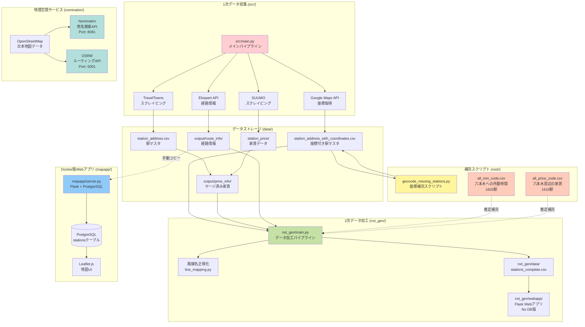
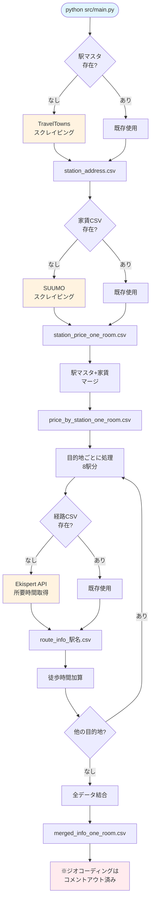
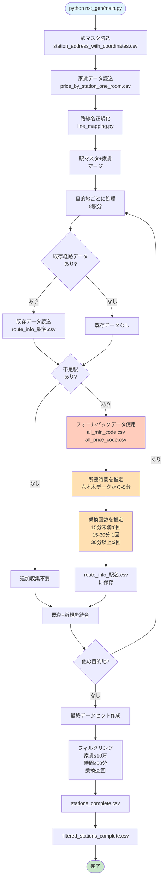
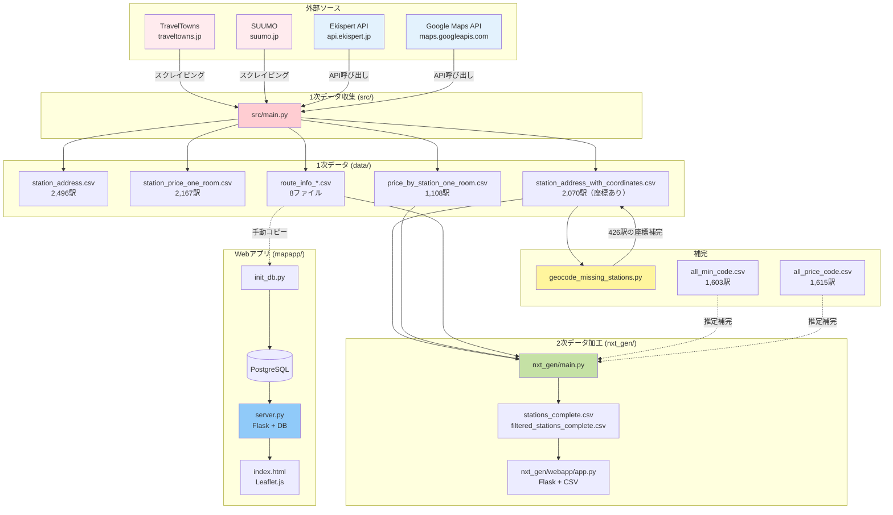

# StationScraper プロジェクト全体像

> **作成日**: 2025年10月19日
> **目的**: プロジェクトの現状を正確に把握し、複雑化した構造を整理するための包括的ドキュメント

## ⚠️ 現状の問題点

このプロジェクトは**同じ目的（駅情報の可視化）に対して3つの異なる実装**が混在しており、以下の問題があります：

- **冗長性**: 類似機能の重複実装
- **データ依存の複雑さ**: 各システムが異なるデータソースに依存
- **未完成部分**: 空ファイルや未実装機能が散在
- **ドキュメント不足**: 実装間の関係性が不明確

---

## プロジェクト構成の全体像



---

## システム別詳細説明

### 1. **src/** - オリジナル実装（1次データ収集）

#### 役割
外部ソースから生データを収集し、CSVファイルとして保存する**データパイプラインの起点**。

#### 処理フロー



#### 主要ファイル

| ファイル | 役割 | 状態 |
|---------|------|------|
| `src/main.py` | メイン処理（Jupyterノートブック的構造） | ✅ 動作 |
| `src/config.py` | 設定ファイル（API KEY、目的地など） | ⚠️ 一部定数未定義 |
| `src/scrapers/traveltowns_scraper.py` | TravelTownsスクレイピング | ✅ 動作 |
| `src/scrapers/suumo_scraper.py` | SUUMOスクレイピング | ✅ 動作 |
| `src/apis/ekispert.py` | Ekispert API呼び出し | ✅ 動作 |
| `src/apis/google_maps.py` | Google Maps API呼び出し | ✅ 動作 |
| `src/apis/analysis.py` | 分析機能 | ❌ **空ファイル** |
| `src/apis/visualization.py` | 可視化機能 | ❌ **空ファイル** |
| `src/pipeline/data_cleaning.py` | データクリーニング | ✅ 動作 |
| `src/pipeline/analysis.py` | フィルタリング処理 | ⚠️ config.pyの未定義定数に依存 |
| `src/pipeline/visualization.py` | 散布図描画 | ✅ 動作 |

#### 生成されるデータ

```
data/
├── line_url.csv                                 # 路線URL（中間データ）
├── station_address.csv                          # 駅マスタ（2,496駅）
├── station_address_with_coordinates.csv         # 座標付き駅マスタ（2,070駅）
├── station_price/
│   └── station_price_one_room.csv               # 家賃データ（2,167駅）
└── output/
    ├── price_info/
    │   └── price_by_station_one_room.csv        # マージ済み（1,108駅）
    ├── route_info/
    │   ├── route_info_虎ノ門ヒルズ.csv
    │   ├── route_info_虎ノ門.csv
    │   ├── route_info_新橋.csv
    │   ├── route_info_霞ケ関.csv
    │   ├── route_info_国会議事堂前.csv
    │   ├── route_info_溜池山王.csv
    │   ├── route_info_桜田門.csv
    │   └── route_info_内幸町.csv                # 各目的地への経路情報
    └── merged/
        └── merged_info_one_room.csv             # 統合データ
```

#### CSVファイル構造詳細

##### 1. line_url.csv
TravelTownsの路線ページURLと路線名の対応表（中間データ）

| カラム名 | データ型 | 説明 |
|---------|---------|------|
| `url` | TEXT | TravelTownsの路線ページURL |
| `line` | TEXT | 路線名 |

##### 2. station_address.csv
関東の全鉄道路線の駅名リスト（2,496駅）

| カラム名 | データ型 | 説明 |
|---------|---------|------|
| `line` | TEXT | 路線名（例: JR山手線） |
| `station` | TEXT | 駅名（例: 東京） |

**生成**: `src/scrapers/traveltowns_scraper.py:scrape_traveltowns_kanto()`

##### 3. station_address_with_coordinates.csv
駅マスタに緯度経度を追加したデータ（2,070駅に座標あり）

| カラム名 | データ型 | 説明 |
|---------|---------|------|
| `line` | TEXT | 路線名 |
| `station` | TEXT | 駅名 |
| `lat` | FLOAT | 緯度 |
| `lng` | FLOAT | 経度 |

**生成**: `src/main.py` (Google Maps API経由、現在はコメントアウト済み)

##### 4. station_price_one_room.csv
SUUMOからスクレイピングした駅ごとのワンルーム家賃相場（2,167駅）

| カラム名 | データ型 | 説明 |
|---------|---------|------|
| `line` | TEXT | 路線名（例: ＊＊山手線） |
| `station` | TEXT | 駅名 |
| `price` | FLOAT | 家賃相場（万円） |

**生成**: `src/scrapers/suumo_scraper.py:scrape_suumo_rent()`

**注意**: 路線名の表記が駅マスタと異なる（全角JR vs 半角JR等）

##### 5. price_by_station_one_room.csv
駅マスタと家賃データをマージしたデータ（1,108駅のみマージ成功、44%）

| カラム名 | データ型 | 説明 |
|---------|---------|------|
| `line` | TEXT | 路線名 |
| `station` | TEXT | 駅名 |
| `price` | FLOAT | 家賃相場（万円）、欠損値あり |

**生成**: `src/pipeline/data_cleaning.py:merge_station_info()`

**問題**: 路線名の表記揺れにより56%の駅が欠損

##### 6. route_info_*.csv
各駅から目的地への経路情報（8つの目的地ごとに生成）

| カラム名 | データ型 | 説明 |
|---------|---------|------|
| `line` | TEXT | 路線名 |
| `price` | FLOAT | 家賃相場（万円） |
| `from` | TEXT | 出発駅 |
| `to` | TEXT | 目的駅（虎ノ門、新橋など） |
| `trans` | INT | 乗換回数 |
| `min` | INT | 電車の所要時間（分） |
| `train+walk_min` | INT | 電車+徒歩の合計時間（分） |

**生成**: `src/main.py` (Ekispert API経由)

**目的地**: 虎ノ門ヒルズ、虎ノ門、新橋、霞ケ関、国会議事堂前、溜池山王、桜田門、内幸町

##### 7. merged_info_one_room.csv
全目的地の経路情報を統合したデータ

| カラム名 | データ型 | 説明 |
|---------|---------|------|
| `line` | TEXT | 路線名 |
| `price` | FLOAT | 家賃相場（万円） |
| `from` | TEXT | 出発駅 |
| `to` | TEXT | 目的駅 |
| `trans` | INT | 乗換回数 |
| `min` | INT | 電車の所要時間（分） |
| `train+walk_min` | INT | 電車+徒歩の合計時間（分） |

**生成**: `src/main.py` (全route_info_*.csvを結合)

#### 問題点
- ✗ Jupyterノートブック的な構造で保守性が低い
- ✗ 空ファイル（analysis.py、visualization.py）が残存
- ✗ ジオコーディング処理がコメントアウトされている
- ✗ 路線名の表記揺れで44%の駅しかマージできていない（[FIX_LINE_NAME_MAPPING.md](./FIX_LINE_NAME_MAPPING.md) 参照）

---

### 2. **nxt_gen/** - リファクタリング版（2次データ加工）

#### 役割
src/で生成された1次データを読み込み、路線名正規化やフィルタリングを行う**データ加工システム**。

#### 処理フロー



#### 重要な仕様

**⚠️ API呼び出しは実装されているが使われていない**

- `route_collector.py`には`collect_route_info()`関数（Ekispert API呼び出し）が実装されている
- しかし`main.py`では**使用されず**、代わりにフォールバックデータで推定している
- フォールバックデータは六本木への経路情報（1,600駅分）
- 虎ノ門への時間は「六本木への時間 - 5分」で推定
- 乗換回数は所要時間から推定（15分未満:0回、15-30分:1回、30分以上:2回）

#### 主要ファイル

| ファイル | 役割 |
|---------|------|
| `nxt_gen/main.py` | メインパイプライン |
| `nxt_gen/config.py` | 設定ファイル（目的地、フィルタ条件） |
| `nxt_gen/data_loader.py` | データ読み込み・保存 |
| `nxt_gen/line_mapping.py` | 路線名正規化マッピング |
| `nxt_gen/route_collector.py` | 経路情報収集（**未使用**） |
| `nxt_gen/data_processor.py` | データ処理・フィルタリング |
| `nxt_gen/webapp/app.py` | Flask Webアプリ（DB不要） |
| `nxt_gen/webapp/templates/index.html` | 地図表示画面 |

#### 生成されるデータ

```
nxt_gen/data/
├── stations_complete.csv           # 全データ
└── filtered_stations_complete.csv  # フィルタ済み
```

#### CSVファイル構造詳細

##### 1. stations_complete.csv
駅情報、座標、家賃、経路情報を統合した完全データセット

| カラム名 | データ型 | 説明 |
|---------|---------|------|
| `line` | TEXT | 路線名（正規化済み） |
| `station` | TEXT | 駅名 |
| `lat` | FLOAT | 緯度 |
| `lng` | FLOAT | 経度 |
| `price` | FLOAT | 家賃相場（万円）、欠損値あり |
| `to_station` | TEXT | 目的駅（虎ノ門ヒルズ、虎ノ門など） |
| `trans` | INT | 乗換回数（推定値） |
| `train_min` | INT | 電車の所要時間（分、推定値） |
| `walk_min` | INT | 駅からの徒歩時間（分） |
| `total_min` | INT | 合計所要時間（train_min + walk_min） |

**生成**: `nxt_gen/data_loader.py:save_data()`

**データソース**:
- 座標: `data/station_address_with_coordinates.csv`
- 家賃: `data/output/price_info/price_by_station_one_room.csv` (路線名正規化後)
- 経路: `data/output/route_info/route_info_*.csv` または `all_min_code.csv` (フォールバック)

**注意**:
- `train_min`と`trans`は六本木データから推定（虎ノ門への時間 = 六本木 - 5分）
- 乗換回数は所要時間から推定（15分未満:0回、15-30分:1回、30分以上:2回）

**データ例**:
```csv
line,station,lat,lng,price,to_station,trans,train_min,walk_min,total_min
JR上越線,高崎,36.3228267,139.0126623,,虎ノ門ヒルズ,2,97,4,101
JR上越線,高崎問屋町,36.34606,139.0171158,,虎ノ門ヒルズ,2,134,4,138
```

##### 2. filtered_stations_complete.csv
stations_complete.csvをフィルタリングしたデータ

**構造**: stations_complete.csvと同じ

**フィルタ条件**（config.pyで設定可能）:
- 家賃: <= 10万円（MAX_PRICE_DEFAULT）
- 所要時間: <= 60分（MAX_TIME_DEFAULT）
- 乗換回数: <= 2回（MAX_TRANS_DEFAULT）

**生成**: `nxt_gen/data_processor.py:filter_stations()`

#### 改善点
- ✓ KISS原則に従ったシンプル設計
- ✓ 路線名の表記揺れを解決
- ✓ Docker不要（pip + pythonのみ）
- ✓ PostgreSQL不要（CSV直接利用）

#### 問題点
- ✗ API呼び出し機能が実装されているのに使われていない
- ✗ フォールバックデータの推定精度が不明
- ✗ src/の1次データに依存（独立して動作しない）

---

### 3. **mapapp/** - Docker版Webアプリ

#### 役割
src/で生成されたデータをPostgreSQLに格納し、Webブラウザで可視化する**本格的なWebアプリケーション**。

#### アーキテクチャ


#### 主要ファイル

| ファイル | 役割 |
|---------|------|
| `mapapp/docker-compose.yml` | Docker構成定義 |
| `mapapp/server.py` | Flaskサーバー（API提供） |
| `mapapp/init_db.py` | PostgreSQL初期化スクリプト |
| `mapapp/static/index.html` | フロントエンド（地図表示） |
| `mapapp/stations.csv` | 駅データ（**手動で配置が必要**） |

#### データベーススキーマ

```sql
CREATE TABLE stations (
    id SERIAL PRIMARY KEY,
    line TEXT,              -- 路線名
    station TEXT,           -- 駅名
    lat DOUBLE PRECISION,   -- 緯度
    lng DOUBLE PRECISION,   -- 経度
    price DOUBLE PRECISION, -- 家賃（万円）
    commute_time INT        -- 通勤時間（分）
);
```

#### API仕様

**GET** `/api/stations`

クエリパラメータ:
- `price_min`: 最低家賃（万円）
- `price_max`: 最高家賃（万円）
- `time_min`: 最短通勤時間（分）
- `time_max`: 最長通勤時間（分）

レスポンス例:
```json
[
  {
    "line": "JR山手線",
    "station": "東京",
    "lat": 35.681236,
    "lng": 139.767125,
    "price": 15.5,
    "commute_time": 20
  }
]
```

#### 起動方法

```bash
cd mapapp
docker-compose up
```

http://localhost:5000 でアクセス

#### 改善点
- ✓ PostgreSQL使用で本格的なデータ管理
- ✓ Docker Composeで環境構築が容易
- ✓ インタラクティブなフィルタリング機能

#### 問題点
- ✗ `stations.csv`を手動配置する必要がある
- ✗ src/のデータに依存
- ✗ nxt_gen/webappと機能が重複

---

### 4. **nominatim/** - 地理空間サービス

#### 役割
OpenStreetMapデータを使用した**地名検索とルーティング機能**を提供。

#### サービス構成

| サービス | ポート | 機能 |
|---------|--------|------|
| Nominatim | 8081 | 地名検索、逆ジオコーディング |
| OSRM | 5001 | ルート計算、距離・時間算出 |

#### 使用例

```bash
# 地名検索
curl "http://localhost:8081/search?q=東京駅&format=json&limit=1"

# ルート計算（東京駅→新宿駅）
curl "http://localhost:5001/route/v1/driving/139.7671,35.6812;139.7006,35.6896?overview=full"
```

#### データソース
- `japan-latest.osm.pbf`: 日本の地図データ
- 初回起動時に前処理が必要（数十分～数時間）

#### 問題点
- ✗ プロジェクト内でほとんど使われていない
- ✗ 代わりにGoogle Maps APIを使用している

---

### 5. 補完スクリプト・データファイル

#### geocode_missing_stations.py

**役割**: 座標が欠損している駅（426駅）の座標をGoogle Maps APIで取得する単発スクリプト。

**処理内容**:
1. `station_address_with_coordinates.csv`から座標欠損駅を抽出
2. 複数のクエリパターンで座標取得を試行
   - パターン1: `{路線名} {駅名}駅`
   - パターン2: `{路線名} {駅名}`
   - パターン3: `{駅名}駅`
   - パターン4: `{駅名}`
3. 結果を`missing_coords_geocoded.csv`に保存

**実行方法**:
```bash
python geocode_missing_stations.py
```

**出力ファイル**: `data/missing_coords_geocoded.csv`

##### CSVファイル構造: missing_coords_geocoded.csv

座標欠損駅のジオコーディング結果（426駅分）

| カラム名 | データ型 | 説明 |
|---------|---------|------|
| `line` | TEXT | 路線名 |
| `station` | TEXT | 駅名 |
| `query` | TEXT | Google Maps APIに使用したクエリ文字列 |
| `lat` | FLOAT | 緯度（取得失敗時はNone） |
| `lng` | FLOAT | 経度（取得失敗時はNone） |
| `success` | BOOLEAN | 座標取得の成否（True/False） |

**生成**: `geocode_missing_stations.py`

**データ例**:
```csv
line,station,query,lat,lng,success
JR上越線,群馬総社,JR上越線 群馬総社駅,36.4158198,139.0323929,True
JR上越線,八木原,JR上越線 八木原駅,36.4635627,139.0191274,True
```

#### all_min_code.csv / all_price_code.csv

**役割**: nxt_gen/のフォールバックデータとして使用される六本木への経路情報。

| ファイル | 内容 | 駅数 |
|---------|------|------|
| `all_min_code.csv` | 各駅から六本木への所要時間（分）と座標 | 1,603駅 |
| `all_price_code.csv` | 各駅の家賃相場（万円）と座標 | 1,615駅 |

##### CSVファイル構造: all_min_code.csv

各駅から六本木への所要時間と座標（1,603駅）

| カラム名 | データ型 | 説明 |
|---------|---------|------|
| (index) | INT | 行番号（0始まり） |
| `min` | INT | 六本木までの所要時間（分） |
| `from` | TEXT | 駅名 |
| `lat` | FLOAT | 緯度 |
| `lng` | FLOAT | 経度 |

**生成**: 外部（由来不明、おそらく過去のパイプライン実行結果）

**データ例**:
```csv
,min,from,lat,lng
0,14,東京,35.68123620000001,139.7671248
1,15,有楽町,35.6750133,139.7630204
```

##### CSVファイル構造: all_price_code.csv

各駅の家賃相場と座標（1,615駅）

| カラム名 | データ型 | 説明 |
|---------|---------|------|
| (index) | INT | 行番号（0始まり） |
| `price` | FLOAT | 家賃相場（万円） |
| `from` | TEXT | 駅名 |
| `lat` | FLOAT | 緯度 |
| `lng` | FLOAT | 経度 |

**生成**: 外部（由来不明、おそらく過去のパイプライン実行結果）

**データ例**:
```csv
,price,from,lat,lng
0,9.6,東京,35.68123620000001,139.7671248
1,10.8,有楽町,35.6750133,139.7630204
```

**使用箇所**: nxt_gen/main.py の`load_fallback_route_data()`関数

---

## データフロー全体図



---

## ディレクトリ構造詳細

```
stationscraper/
├── .env                                    # 環境変数（APIキー）
├── .gitignore
├── CLAUDE.md                               # Claude Code向けプロジェクト説明
├── README.md                               # プロジェクト概要（既存）
├── FIX_LINE_NAME_MAPPING.md                # 路線名マッピング問題の解決ガイド
├── PROJECT_OVERVIEW.md                     # 本ドキュメント
│
├── geocode_missing_stations.py             # 座標欠損補完スクリプト
├── all_min_code.csv                        # 六本木への所要時間（1,603駅）
├── all_price_code.csv                      # 六本木周辺の家賃（1,615駅）
│
├── data/                                   # データストレージ
│   ├── line_url.csv
│   ├── station_address.csv                 # 駅マスタ（2,496駅）
│   ├── station_address_with_coordinates.csv # 座標付き駅マスタ（2,070駅）
│   ├── missing_coords_geocoded.csv         # 座標補完結果
│   ├── station_price/
│   │   ├── station_price_one_room.csv      # ワンルーム家賃（2,167駅）
│   │   ├── station_price_1k.csv
│   │   └── station_price_2k.csv
│   └── output/
│       ├── price_info/
│       │   └── price_by_station_one_room.csv # マージ済み（1,108駅）
│       ├── route_info/                     # 各目的地への経路情報
│       │   ├── route_info_虎ノ門ヒルズ.csv
│       │   ├── route_info_虎ノ門.csv
│       │   ├── route_info_新橋.csv
│       │   ├── route_info_霞ケ関.csv
│       │   ├── route_info_国会議事堂前.csv
│       │   ├── route_info_溜池山王.csv
│       │   ├── route_info_桜田門.csv
│       │   └── route_info_内幸町.csv
│       └── merged/
│           └── merged_info_one_room.csv    # 統合データ
│
├── src/                                    # 1次データ収集（オリジナル実装）
│   ├── main.py                             # メインパイプライン
│   ├── config.py                           # 設定ファイル
│   ├── scrapers/
│   │   ├── traveltowns_scraper.py          # TravelTownsスクレイピング
│   │   └── suumo_scraper.py                # SUUMOスクレイピング
│   ├── apis/
│   │   ├── ekispert.py                     # Ekispert API
│   │   ├── google_maps.py                  # Google Maps API
│   │   ├── analysis.py                     # ❌ 空ファイル
│   │   └── visualization.py                # ❌ 空ファイル
│   └── pipeline/
│       ├── data_cleaning.py                # データクリーニング
│       ├── analysis.py                     # フィルタリング
│       └── visualization.py                # 散布図描画
│
├── nxt_gen/                                # 2次データ加工（リファクタリング版）
│   ├── README.md                           # nxt_gen説明
│   ├── main.py                             # メインパイプライン
│   ├── config.py                           # 設定ファイル
│   ├── data_loader.py                      # データ読み込み・保存
│   ├── line_mapping.py                     # 路線名正規化
│   ├── route_collector.py                  # 経路情報収集（未使用）
│   ├── route_collector_backup.py           # バックアップ
│   ├── data_processor.py                   # データ処理
│   ├── data/                               # 出力データ
│   │   ├── stations_complete.csv
│   │   └── filtered_stations_complete.csv
│   └── webapp/                             # Flask Webアプリ（DB不要）
│       ├── app.py                          # Flaskサーバー
│       ├── static/
│       └── templates/
│           └── index.html                  # 地図表示画面
│
├── mapapp/                                 # Docker版Webアプリ
│   ├── docker-compose.yml                  # Docker構成
│   ├── Dockerfile
│   ├── requirements.txt
│   ├── init_db.py                          # DB初期化
│   ├── server.py                           # Flaskサーバー
│   ├── static/
│   │   ├── index.html                      # フロントエンド
│   │   └── main.js
│   └── stations.csv                        # 駅データ（要手動配置）
│
└── nominatim/                              # 地理空間サービス（ほぼ未使用）
    ├── README.md
    ├── docker-compose.yml
    ├── japan-latest.osm.pbf/               # 日本地図データ
    ├── osrm-data/                          # OSRMデータ
    └── osrm-profile/                       # OSRMプロファイル
```

---

## 実行方法まとめ

### 1次データ収集（src/）

```bash
# 環境変数設定（.envファイル作成）
EKISPERT_KEY=your_key_here
GOOGLE_MAPS_KEY=your_key_here

# 依存パッケージインストール
pip install -r requirements.txt
pip install python-dotenv  # requirements.txtに未記載

# メインパイプライン実行
cd src
python main.py
```

**注意**: 初回実行時はスクレイピング・API呼び出しで数時間かかる可能性あり。

### 座標補完（geocode_missing_stations.py）

```bash
python geocode_missing_stations.py
```

### 2次データ加工（nxt_gen/）

```bash
cd nxt_gen
python main.py

# Webアプリ起動
cd webapp
python app.py
# http://localhost:5000
```

### Docker版Webアプリ（mapapp/）

```bash
cd mapapp

# stations.csvを配置（手動）
# cp ../data/output/merged/merged_info_one_room.csv stations.csv

# Docker起動
docker-compose up
# http://localhost:5000
```

### 地理空間サービス（nominatim/）

```bash
cd nominatim
docker-compose up -d

# 初回起動は前処理に数十分～数時間かかる
# http://localhost:8081 (Nominatim)
# http://localhost:5001 (OSRM)
```

---

## 問題点と改善提案

### 現状の問題点

#### 1. **冗長性**
- 同じ目的に対して3つの実装（src/、nxt_gen/、mapapp/）が存在
- nxt_gen/webappとmapappのWebアプリ機能が重複
- データファイルの重複

#### 2. **依存関係の複雑さ**
- nxt_gen/はsrc/の出力に依存
- mapapp/もsrc/の出力に依存
- 独立して動作するシステムがない

#### 3. **未完成部分**
- src/apis/analysis.py（空ファイル）
- src/apis/visualization.py（空ファイル）
- src/config.pyの一部定数未定義
- nxt_gen/route_collector.pyが実装されているが未使用

#### 4. **データ品質**
- 路線名の表記揺れで44%の駅しかマージできていない
- フォールバックデータの推定精度が不明
- 座標欠損が426駅（17%）存在

#### 5. **ドキュメント不足**
- 各実装間の関係性が不明確
- データの依存関係が文書化されていない
- 実行順序が明確でない

### 改善提案

#### 短期的改善

1. **空ファイルの削除**
   - src/apis/analysis.py
   - src/apis/visualization.py

2. **設定ファイルの修正**
   - src/config.pyに不足している定数を追加
   - requirements.txtにpython-dotenvを追加

3. **データパイプラインの整備**
   - 実行順序を明確にするREADMEの更新
   - 各ステップの必須/オプションを明記

#### 中期的改善

1. **実装の統合**
   - nxt_gen/webappまたはmapappのどちらかに統一
   - 不要な実装を削除

2. **データ品質の向上**
   - 路線名マッピングの完全実装（FIX_LINE_NAME_MAPPING.md参照）
   - 座標欠損の完全解消

3. **API呼び出しの整理**
   - nxt_gen/でフォールバックではなく実際にAPI呼び出しを使用
   - または、フォールバックのみに徹する

#### 長期的改善

1. **システムの再設計**
   - 1次データ収集、2次データ加工、可視化を明確に分離
   - 各コンポーネントを独立して動作可能にする

2. **データベース化**
   - CSVファイルではなくPostgreSQLで一元管理
   - データのバージョン管理

3. **テストの追加**
   - スクレイピング処理の単体テスト
   - データ加工処理の統合テスト

---

## まとめ

このプロジェクトは**段階的に機能を追加してきた結果、3つの実装が並存**している状態です。

### 各実装の特徴

| 実装 | 役割 | 独立性 | 推奨度 |
|-----|------|--------|--------|
| **src/** | 1次データ収集 | ✓ 独立 | ⭐⭐⭐ 必須 |
| **nxt_gen/** | 2次データ加工 | ✗ src/に依存 | ⭐⭐ 便利 |
| **mapapp/** | Docker版Web可視化 | ✗ src/に依存 | ⭐⭐ 便利 |
| **nominatim/** | 地理空間サービス | ✓ 独立 | ⭐ ほぼ未使用 |

### 推奨される使い方

**最小構成**（データ収集のみ）:
```bash
cd src
python main.py
```

**可視化まで含む**（nxt_gen使用）:
```bash
# 1. データ収集
cd src
python main.py

# 2. データ加工・可視化
cd ../nxt_gen
python main.py
cd webapp
python app.py
```

**本格運用**（Docker使用）:
```bash
# 1. データ収集
cd src
python main.py

# 2. Webアプリ起動
cd ../mapapp
# stations.csvを配置
docker-compose up
```

---

## 関連ドキュメント

- [CLAUDE.md](./CLAUDE.md) - Claude Code向けプロジェクト説明
- [README.md](./README.md) - プロジェクト概要（Mermaid図含む）
- [FIX_LINE_NAME_MAPPING.md](./FIX_LINE_NAME_MAPPING.md) - 路線名マッピング問題の解決ガイド
- [nxt_gen/README.md](./nxt_gen/README.md) - nxt_gen説明
- [nominatim/README.md](./nominatim/README.md) - Nominatim説明

---

**作成者**: Claude Code
**最終更新**: 2025年10月19日
