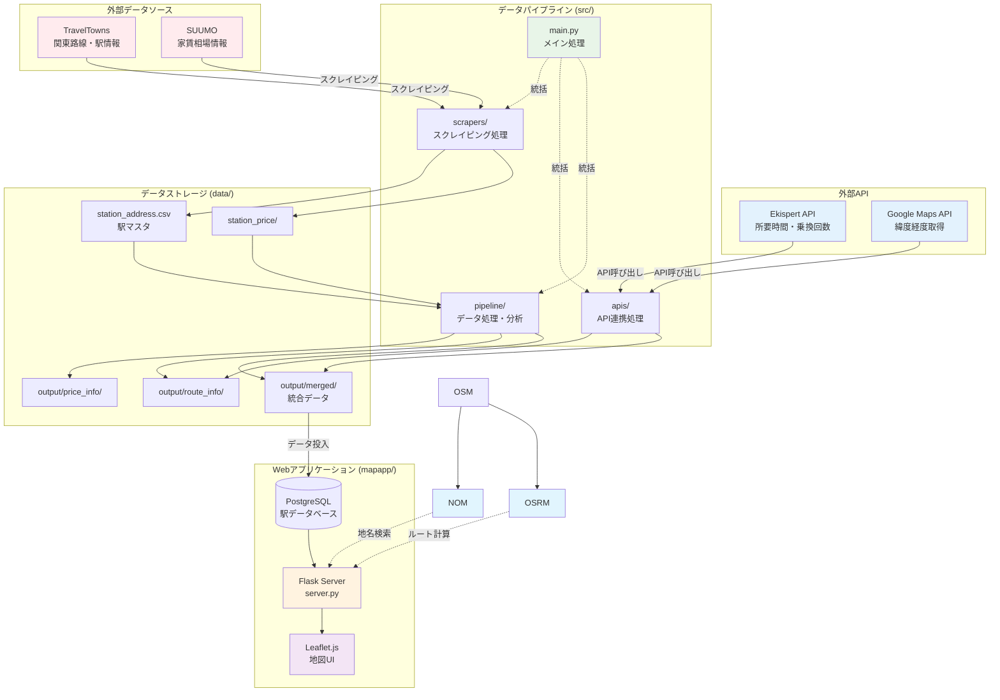
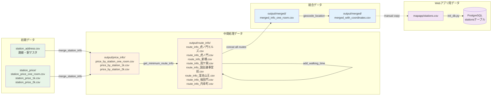

# stationscraper

このリポジトリは関東エリアを中心とした「路線・駅情報」や「家賃相場」「目的地までの所要時間」などをスクレイピングおよびAPI連携を通じて取得し、データを加工・可視化するサンプルプロジェクトです。

## 概要

### スクレイピング処理
- TravelTowns や SUUMO を対象に、路線・駅マスタや家賃相場情報を取得します。

### API連携
- Ekispert API で駅間の所要時間・乗り換え回数を取得
- Google Maps Geocoding API で駅ごとの緯度経度を取得

### データ加工・分析
- 取得したデータをマージし、時間や家賃などの条件でフィルタや可視化を実施

## 処理フロー図

### メインパイプライン処理フロー

以下は `src/make_base_data.py` の実行フローを示した図です：

```mermaid
flowchart TD
    A[開始: python src/make_base_data.py] --> B{駅マスタCSV<br/>存在チェック}
    
    B -->|なし| C[TravelTownスクレイピング<br/>関東地方の路線・駅マスタ取得]
    B -->|あり| D[既存ファイル使用]
    C --> E[station_address.csv保存]
    D --> E
    E --> F{家賃相場CSV<br/>存在チェック}
    
    F -->|なし| G[SUUMOスクレイピング<br/>1都3県の家賃相場取得]
    F -->|あり| H[既存ファイル使用]
    G --> I[station_price_{ROOM_TYPE}.csv保存]
    H --> I
    I --> J[データマージ<br/>駅マスタ + 家賃相場]
    J --> K[price_by_station_{ROOM_TYPE}.csv保存]
    
    K --> L[目的地駅ごとの処理開始<br/>WALK_MINUTES.keys()]
    L --> M{ルート情報CSV<br/>存在チェック}
    M -->|なし| N[Ekispert API呼び出し<br/>駅間所要時間・乗換回数取得]
    M -->|あり| O[既存ファイル使用]
    N --> P[route_info_{目的地}.csv保存]
    O --> P
    P --> Q[徒歩時間加算<br/>WALK_MINUTES辞書から取得]
    Q --> R{他の目的地<br/>あり？}
    R -->|あり| L
    R -->|なし| S[全目的地データ結合]
    
    S --> T[merged_info_{ROOM_TYPE}.csv保存]
    T --> U[Google Maps Geocoding API<br/>各駅の緯度経度取得]
    U --> V[merged_with_coordinates.csv保存]
    V --> W[処理完了]
    
    style A fill:#e1f5fe
    style W fill:#c8e6c9
    style C fill:#fff3e0
    style G fill:#fff3e0
    style N fill:#fff3e0
    style U fill:#fff3e0
```

### システム全体アーキテクチャ

プロジェクト全体の構成要素と関係性を示した図です：



### CSVデータ変換フロー

`data/` ディレクトリ内でのCSVファイルの変換フローを示した図です：



## 主な機能

### 駅リストの取得
- `src/scrapers/traveltowns_scraper.py` を用いて関東エリアの路線・駅リストを取得

### 家賃相場の取得
- `src/scrapers/suumo_scraper.py` を用いて SUUMO から駅ごとの家賃相場をスクレイピング

### 所要時間の取得
- `src/apis/ekispert.py` を介して Ekispert API から駅間の所要時間・乗り換え回数を取得

### 緯度経度の取得
- `src/apis/google_maps.py` を介して Google Maps Geocoding API から駅の座標情報を取得

### データマージとフィルタ
- `src/pipeline/data_cleaning.py` で複数のCSVを結合し、所要時間や家賃に応じたデータフィルタリング処理を実行

### 簡易的な分析と可視化
- `src/pipeline/analysis.py` で条件別にCSVを分割保存
- `src/pipeline/visualization.py` で散布図を描画

## ディレクトリ構成

```
stationscraper
├── .env                     # APIキーなどを管理する環境変数ファイル(手動で作成)
├── .gitignore              # Git向けの無視リスト
├── data/
│   ├── station_address.csv # 駅マスタ情報
│   ├── station_price/      # 家賃相場データ
│   │   ├── station_price_1k.csv
│   │   ├── station_price_2k.csv
│   │   └── station_price_one_room.csv
│   └── output/
│       ├── merged/         # マージされたデータ
│       │   ├── merged_with_coordinates.csv
│       │   └── mergend_info_one_room.csv
│       ├── price_info/     # 価格情報
│       │   ├── price_by_station_1k.csv
│       │   ├── price_by_station_2k.csv
│       │   └── price_by_station_one_room.csv
│       └── route_info/     # 路線情報
│           ├── route_info_内幸町.csv
│           ├── route_info_国会議事堂前.csv
│           ├── route_info_大塚.csv
│           └── ... (その他の駅)
├── mapapp/                 # Webアプリケーション
│   ├── Dockerfile
│   ├── docker-compose.yml
│   ├── init_db.py
│   ├── requirements.txt
│   ├── server.py
│   ├── static/
│   │   ├── index.html
│   │   └── main.js
│   └── stations.csv
├── requirements.txt        # 必要なPythonパッケージ
└── src/
    ├── apis/
    │   ├── analysis.py     # 空ファイル（未実装）
    │   ├── ekispert.py
    │   ├── google_maps.py
    │   └── visualization.py # 空ファイル（未実装）
    ├── config.py
    ├── main.py             # メイン処理エントリーポイント
    ├── pipeline/
    │   ├── analysis.py
    │   ├── data_cleaning.py
    │   └── visualization.py
    └── scrapers/
        ├── suumo_scraper.py
        └── traveltowns_scraper.py
```

## 主要ファイル説明

### `src/make_base_data.py`
- 全体の実行フローをまとめたエントリーポイント

### `src/scrapers/`
- `traveltowns_scraper.py`: TravelTowns から関東の駅マスタをスクレイピング
- `suumo_scraper.py`: SUUMO から沿線別・駅別の家賃相場をスクレイピング

### `src/apis/`
- `ekispert.py`: Ekispert API で正式駅名や所要時間を取得
- `google_maps.py`: Google Maps Geocoding API で各駅の緯度経度を取得
- `analysis.py`: 空ファイル（未実装）
- `visualization.py`: 空ファイル（未実装）

### `src/pipeline/`
- `data_cleaning.py`: 駅マスタと家賃を結合、時間・家賃フィルタや徒歩時間加算などの処理
- `analysis.py`: フィルタ後のデータを条件ごとに分析・分割保存
- `visualization.py`: 散布図など可視化に関連する処理

### `src/config.py`
- 環境変数のロードやプロジェクトで利用する各種定数（APIキー、閾値など）を設定
- **注意**: `MAX_TRANS_DEFAULT`, `MAX_TIME_DEFAULT`, `MAX_PRICE_DEFAULT` が未定義のため、`src/pipeline/analysis.py` でエラーが発生する可能性があります

## セットアップ

### リポジトリをクローン
```bash
git clone https://github.com/xxx/stationscraper.git
cd stationscraper
```

### Python環境の準備
仮想環境 (venv) の使用を推奨します。
```bash
python -m venv venv
source venv/bin/activate  # Windows: venv\Scripts\activate
```

### 依存パッケージのインストール
```bash
pip install -r requirements.txt
```

**注意**: `requirements.txt` に `python-dotenv` が含まれていないため、手動でインストールが必要です。
```bash
pip install python-dotenv
```

### APIキーの設定 (.env ファイル作成)
`.env` ファイルに以下のように記載します。
```dotenv
EKISPERT_KEY=YOUR_EKISPERT_API_KEY
GOOGLE_MAPS_KEY=YOUR_GOOGLE_MAPS_API_KEY
```

### データディレクトリの確認
- プロジェクト直下に `data` ディレクトリが必要です。
- スクレイピング結果や処理済みCSVは `data/output` 以下に保存されます。
- 初回実行時に必要なサブディレクトリは自動的に作成されます。

## 使い方

### メインスクリプトの実行
```bash
python src/make_base_data.py
```
- `traveltowns_scraper.py`: 路線・駅マスタ取得
- `suumo_scraper.py`: 家賃相場取得
- データマージ後、目的地までの所要時間を `ekispert.py` で取得
- 徒歩時間を加算し、CSV出力およびデータフィルタリングなどのサンプル処理実行

### パラメータ変更
- `src/config.py` の `MAX_TIME_DEFAULT` や `ROOM_TYPE` などを変更可能
- `WALK_MINUTES` を調整して目的地の駅数や徒歩時間を設定

### Webアプリケーション

`mapapp` ディレクトリには、取得したデータを地図上で可視化するWebアプリケーションが含まれています。

#### 技術スタック
- **バックエンド**: Flask (Python)
- **データベース**: PostgreSQL
- **フロントエンド**: Leaflet.js (JavaScript)
- **インフラ**: Docker Compose

#### 主な機能

1. **インタラクティブ地図表示**
   - 関東地方の駅を地図上にマーカー表示
   - 各駅の家賃相場と通勤時間を色分けで可視化

2. **リアルタイムフィルタリング**
   - 家賃範囲での絞り込み（スライダー操作）
   - 通勤時間での絞り込み（スライダー操作）
   - 条件に合致する駅のみを動的に表示

3. **駅詳細情報**
   - 駅名、路線名
   - 家賃相場（万円）
   - 通勤時間（分）
   - マーカークリックで詳細ポップアップ表示

#### API エンドポイント

- `GET /` - メイン画面（index.html）
- `GET /api/stations?price_min={値}&price_max={値}&time_min={値}&time_max={値}` - 条件に合致する駅データを JSON で返却

#### 実行方法

```bash
cd mapapp
docker-compose up
```

アプリケーションは http://localhost:5000 でアクセス可能になります。

#### データフロー

1. **初期化時**: `init_db.py` が `stations.csv` を読み込み、PostgreSQL に駅データを投入
2. **API呼び出し**: フロントエンドからのフィルタ条件に基づいて SQL クエリを実行
3. **地図更新**: 取得した駅データを Leaflet.js でマーカー表示・更新

### 拡張
- `pipeline` 以下のスクリプトを修正し、家賃以外に「築年数」や「部屋サイズ」などを追加分析可能
- `apis/visualization.py` と連携し、Folium などの地図表示ツールとの組み合わせも検討可能
- `mapapp` のWebアプリケーションを拡張してより詳細な分析機能を追加可能

## 注意事項

### API利用制限
- Ekispert API, Google Maps Geocoding API は無料枠・使用制限あり
- 本格運用の際は課金プランや上限を確認してください

### スクレイピング
- 公共データ取得を目的としたサンプルですが、対象サイトの負荷や利用規約に留意してください
